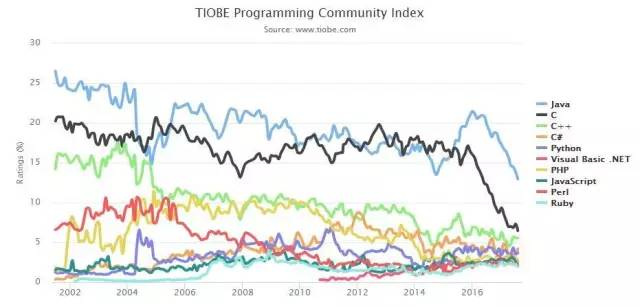

# 第一章 走进Python世界
# 1.1 Python简介

    Life is short, you need Python! --- Bruce Eckel

Python是一种面向对象的解释型计算机程序设计语言，由荷兰人Guido van Rossum于1989年发明，第一个公开发行版发行于1991年。其源代码和解释器CPython遵循 GPL(GNU General Public License)协议，详情见官网：https://www.python.org/。

由于Python具有丰富和强大的库，因此常被昵称为胶水语言。它可以非常方便地把用其他语言制作的模块（如C/C++编写的模块）联结在一起。常见的一种应用情形是，使用Python快速生成程序的原型（有时甚至是程序的最终界面），然后对其中有特别要求（如计算效率等）的部分，用更合适的语言改写，比如3D游戏中的图形渲染模块，TensorFlow等，使用效率高的C/C++语言写算法模块。

2017年TIOBE发布了全球编程语言排行榜，Python升至第四名。 

### 发展历程
自从20世纪90年代初Python语言诞生至今，它已被逐渐广泛应用于系统管理任务和Web编程等。近些年，在自然语言处理、科学计算领域更是得到突出的发展，成为最受欢迎的编程语言之一。

1989年圣诞节期间，在阿姆斯特丹，Guido为了打发圣诞节的无趣，决心开发一个新的脚本解释程序，做为ABC语言的一种继承。之所以选中Python（大蟒蛇的意思）作为该编程语言的名字，是因为他是一个叫Monty Python的喜剧团体的爱好者。

    TODO: 使用版本演进图

### 设计哲学
Python的设计哲学是“优雅”、“明确”、“简单”。

## 编程风格
Python在设计上坚持了清晰划一的风格，这使得Python程序非常易读、易维护，得到大量用户欢迎。

         The Zen of Python                                                        Python之禅（赖勇浩翻译）
    Beautiful is better than ugly.                                               优美胜于丑陋。
    Explicit is better than implicit.                                            明了胜于晦涩。
    Simple is better than complex.                                               简洁胜于复杂。
    Complex is better than complicated.                                          复杂胜于凌乱。
    Flat is better than nested.                                                  扁平胜于嵌套。
    Sparse is better than dense.                                                 间隔胜于紧凑。
    Readability counts.                                                          可读性很重要。
    Special cases aren't special enough to break the rules.                      即便假借特例的实用性之名，也不可违背这些规则。
    Although practicality beats purity.                                          
    Errors should never pass silently.                                           
    Unless explicitly silenced.                                                  不要包容所有错误，除非你确定需要这样做。
    In the face of ambiguity, refuse the temptation to guess.                    当存在多种可能，不要尝试去猜测。
    There should be one-- and preferably only one --obvious way to do it.        而是尽量找一种，最好是唯一一种明显的解决方案。
    Although that way may not be obvious at first unless you're Dutch.           虽然这并不容易，因为你不是 Python 之父。
    Now is better than never.
    Although never is often better than *right* now.                             做也许好过不做，但不假思索就动手还不如不做。
    If the implementation is hard to explain, it's a bad idea.                   如果你无法向人描述你的方案，那肯定不是一个好方案。
    If the implementation is easy to explain, it may be a good idea.             反之亦然。
    Namespaces are one honking great idea -- let's do more of those!             命名空间是一种绝妙的理念，我们应当多加利用。

值得一提的是Python缩进规则。这一有意设计的限制性很强的规则使得开发者们写出更多职责单一，代码清晰，短小的代码。

常见的编程规范有：[Google Python编程风格指南](https://google.github.io/styleguide/pyguide.html)，[PEP 8](https://www.python.org/dev/peps/pep-0008/)等。

## 程序执行

Python在执行时，首先会将.py文件中的源代码编译成Python的byte code（字节码），然后再由Python Virtual Machine（Python虚拟机）来执行这些编译好的byte code。这种机制的基本思想跟Java，.NET是一致的。然而，Python Virtual Machine与Java或.NET的Virtual Machine不同的是，Python的Virtual Machine是一种更高级的Virtual Machine。这里的高级并不是通常意义上的高级，不是说Python的Virtual Machine比Java或.NET的功能更强大，而是说和Java 或.NET相比，Python的Virtual Machine距离真实机器的距离更远。或者可以这么说，Python的Virtual Machine是一种抽象层次更高的Virtual Machine。
基于C的Python编译出的字节码文件，通常是.pyc格式。

除此之外，Python还可以以交互模式运行，比如主流操作系统Unix/Linux、Mac、Windows都可以直接在命令模式下直接运行Python交互环境。直接下达操作指令即可实现交互操作。

# 1.2 Python代码组成

本书将以当前Python3.6.3版本代码讲解，大家可以在https://www.python.org/downloads/source/ 上进行下载。主要目录如下：

**Grammer**：Python语言的语法规则。

**Include**: 包含所有的引用的C/C++头文件。

**Lib**：使用Python语言编写的库。

**Modules**：使用C语言编写的库，主要是对计算效率要求较高的模块。

**Objects**: Python语言的内建对象，如整数、string、list、dict等。

**Parser**: Python语言的词法分析器，语法分析器。

**Python**: Python语言的解释器中的编译器及执行引擎。是Python运行的核心。

**PCBiuld**: 包含了Visual Studio 2015的工程文件，从此处可进行编译Python源代码。

# 1.3 Windows环境下编译Python

# 1.4 Unix环境下编译Python

# 1.5 Mac环境下编译Python

# 1.6 搭建测试环境

# 1.7 本书约定

# 1.8 小结