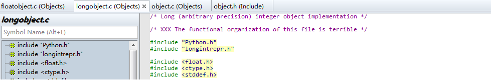

# 整型对象
在Python2.5中整型对象在intobject.c中， 而在Python3.6中，改为在longobject.c中实现。

当我看到源码的第一行时，惊呆了：

换句话说，当你计算两个大整数的乘法时，一行代码就可以搞定！

    >>> a = 23847239874523897534987502945720358920345982304582305
    >>> b = 345983095820349853402985603492670324578903485029348502845012984
    >>> c = a * b
    >>> print(c)
    8250741878558269455749359195765491777470735536010901166040074992587621787618386562974290257023500207063400421648120
    >>>

单凭这一点，是否已经勾引起你的兴趣了呢？ 如果还没有，还可以再举一个例子：
一般情况下，当定义一个对象时，会专门开辟一块内存空间用于存储，我们可以使用id()操作，将其内存地址打印出来，如：

    >>> a = 100
    >>> hex(id(a))
        '0x5d32d310'     对象a的十六进制地址表示
接着，我们再定义一个值相同的对象：

    >>> b = 100
    >>> hex(id(b))
        '0x5d32d310'     对象b的十六进制地址表示, 竟然和a一样？？？ 难道不怕修改a时，连带着把b的值修改掉？ 显然是不可以的

再接着，我们猜测是不是所有值相同的对象，均是共享的呢？

    >>> c = 1234
    >>> d = 1234
    >>> hex(id(c))
    '0x1fea470'
    >>> hex(id(d))
    '0x1feaef0'         对象c和d的地址又不同了！！！

虽然整型对象是非常常用且简单的对象，但是还是有非常多学习的地方. Let's go!!!

# 整型对象定义
    typedef uint32_t digit;  /* digit的定义，取决于PYLONG_BITS_IN_DIGIT的值， 此外暂以unint32_t来分析代码*/
    struct _longobject {
        PyObject_VAR_HEAD
        digit ob_digit[1];
    };
So easy!  但是如果你阅读过Python2.5代码，你会发现，在Python3.6中，longobject不再是定长对象了。从结构体定义来看， 就是对ob_digit封装了一层。但这里却有两个问题：
* 在哪里记录整型对象所占用的内存大小
* 如何实现支持任意精度

从结构体上可以很容易猜测出第一个问题的答案应该在PyOject_VAR_HEAD宏中：

    typedef struct {
        PyObject ob_base;
        Py_ssize_t ob_size; /* Number of items in variable part */
    } PyVarObject;
ob_size代表了item的个数，还不能确切表示内存的大小。从前文我们了解到PyObject对象是定义为：
    
    typedef struct _object {
        Py_ssize_t ob_refcnt;
        struct _typeobject *ob_type;
    } PyObject;
因此，每个item的大小只能在ob_type结构体里了。对于整型的对象，其类型定义为如下：

    PyTypeObject PyLong_Type = {
        PyVarObject_HEAD_INIT(&PyType_Type, 0)
        "int",                                      /* tp_name */
        offsetof(PyLongObject, ob_digit),           /* tp_basicsize */
        sizeof(digit),                              /* tp_itemsize */
        long_dealloc,                               /* tp_dealloc */
        0,                                          /* tp_print */
        0,                                          /* tp_getattr */
        0,                                          /* tp_setattr */
        0,                                          /* tp_reserved */
        long_to_decimal_string,                     /* tp_repr */
        &long_as_number,                            /* tp_as_number */
        0,                                          /* tp_as_sequence */
        0,                                          /* tp_as_mapping */
        (hashfunc)long_hash,                        /* tp_hash */
        0,                                          /* tp_call */
        long_to_decimal_string,                     /* tp_str */
        PyObject_GenericGetAttr,                    /* tp_getattro */
        0,                                          /* tp_setattro */
        0,                                          /* tp_as_buffer */
        Py_TPFLAGS_DEFAULT | Py_TPFLAGS_BASETYPE |
            Py_TPFLAGS_LONG_SUBCLASS,               /* tp_flags */
        long_doc,                                   /* tp_doc */
        0,                                          /* tp_traverse */
        0,                                          /* tp_clear */
        long_richcompare,                           /* tp_richcompare */
        0,                                          /* tp_weaklistoffset */
        0,                                          /* tp_iter */
        0,                                          /* tp_iternext */
        long_methods,                               /* tp_methods */
        0,                                          /* tp_members */
        long_getset,                                /* tp_getset */
        0,                                          /* tp_base */
        0,                                          /* tp_dict */
        0,                                          /* tp_descr_get */
        0,                                          /* tp_descr_set */
        0,                                          /* tp_dictoffset */
        0,                                          /* tp_init */
        0,                                          /* tp_alloc */
        long_new,                                   /* tp_new */
        PyObject_Del,                               /* tp_free */
    };
其中，所支持的整数操作有：

    static PyNumberMethods long_as_number = {
        (binaryfunc)long_add,       /*nb_add*/
        (binaryfunc)long_sub,       /*nb_subtract*/
        (binaryfunc)long_mul,       /*nb_multiply*/
        long_mod,                   /*nb_remainder*/
        long_divmod,                /*nb_divmod*/
        long_pow,                   /*nb_power*/
        (unaryfunc)long_neg,        /*nb_negative*/
        (unaryfunc)long_long,       /*tp_positive*/
        (unaryfunc)long_abs,        /*tp_absolute*/
        (inquiry)long_bool,         /*tp_bool*/
        (unaryfunc)long_invert,     /*nb_invert*/
        long_lshift,                /*nb_lshift*/
        (binaryfunc)long_rshift,    /*nb_rshift*/
        long_and,                   /*nb_and*/
        long_xor,                   /*nb_xor*/
        long_or,                    /*nb_or*/
        long_long,                  /*nb_int*/
        0,                          /*nb_reserved*/
        long_float,                 /*nb_float*/
        0,                          /* nb_inplace_add */
        0,                          /* nb_inplace_subtract */
        0,                          /* nb_inplace_multiply */
        0,                          /* nb_inplace_remainder */
        0,                          /* nb_inplace_power */
        0,                          /* nb_inplace_lshift */
        0,                          /* nb_inplace_rshift */
        0,                          /* nb_inplace_and */
        0,                          /* nb_inplace_xor */
        0,                          /* nb_inplace_or */
        long_div,                   /* nb_floor_divide */
        long_true_divide,           /* nb_true_divide */
        0,                          /* nb_inplace_floor_divide */
        0,                          /* nb_inplace_true_divide */
        long_long,                  /* nb_index */
    };

如何能够支持任意精度呢？ 这将涉及到内存的分配问题，那我们就从对象的创建与销毁讲起

# 整型创建与销毁
整型对象是程序中最常用对象之一。对于Python来说，对象的创建与销毁均需要在堆上进行申请与释放。所以这必然会导致效率的低下。而且也会导致内存产生大量的碎片。
另一个解决问题的极端方法是，所以整数对象一次申请，并不释放。虽然很大程度上提高了效率，但是内存利用率是无法忍受的。因此Gui叔把整数分为两部分，小整数和普通整数。
* 对于小整数来说，一次申请，但不释放
* 对于普通整数则一次申请，一次“释放”（这里并不是真正的释放内存！）

# 走进大师
分析 一下 大数相乘 代码，并分析其算法复杂度。

